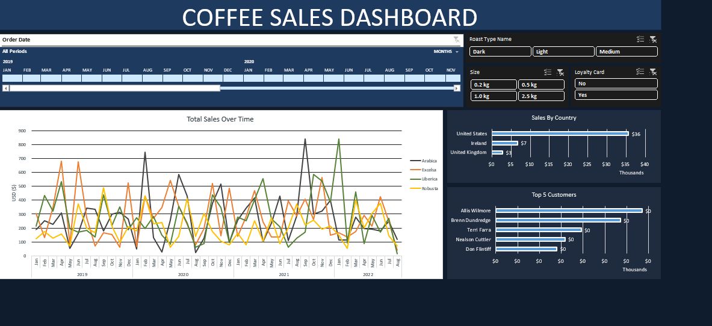

# Coffee Orders Data Analysis-

## Project Overview
This project focuses on analyzing coffee sales data to extract key business insights. The primary objective was to examine sales trends, customer purchasing behavior, and regional performance using data transformation, and visualization techniques.

## Key Insights

### 1. Sales Trends
- Evaluated historical sales data to identify overall trends.
- **Arabica (Light Roast)** emerged as the most popular coffee type.

### 2. Sales by Region
- The **United States** recorded the highest sales volume.
- A **bar chart** was created to visualize sales distribution across different countries.

### 3. Customer Behavior
- Identified the **top 5 highest-spending customers**.
- Observed that **loyalty program members tend to spend more**, highlighting its impact on revenue.

## Visualizations & Dashboard
- Designed an **interactive dashboard** to present key findings.
- Included:
  - **Top 5 Customers Chart** to showcase high-value customers.
  - **Country-wise Sales Bar Chart** for regional sales distribution.
  - **Total Sales Breakdown** to analyze revenue by coffee type and year.

## Screenshot

